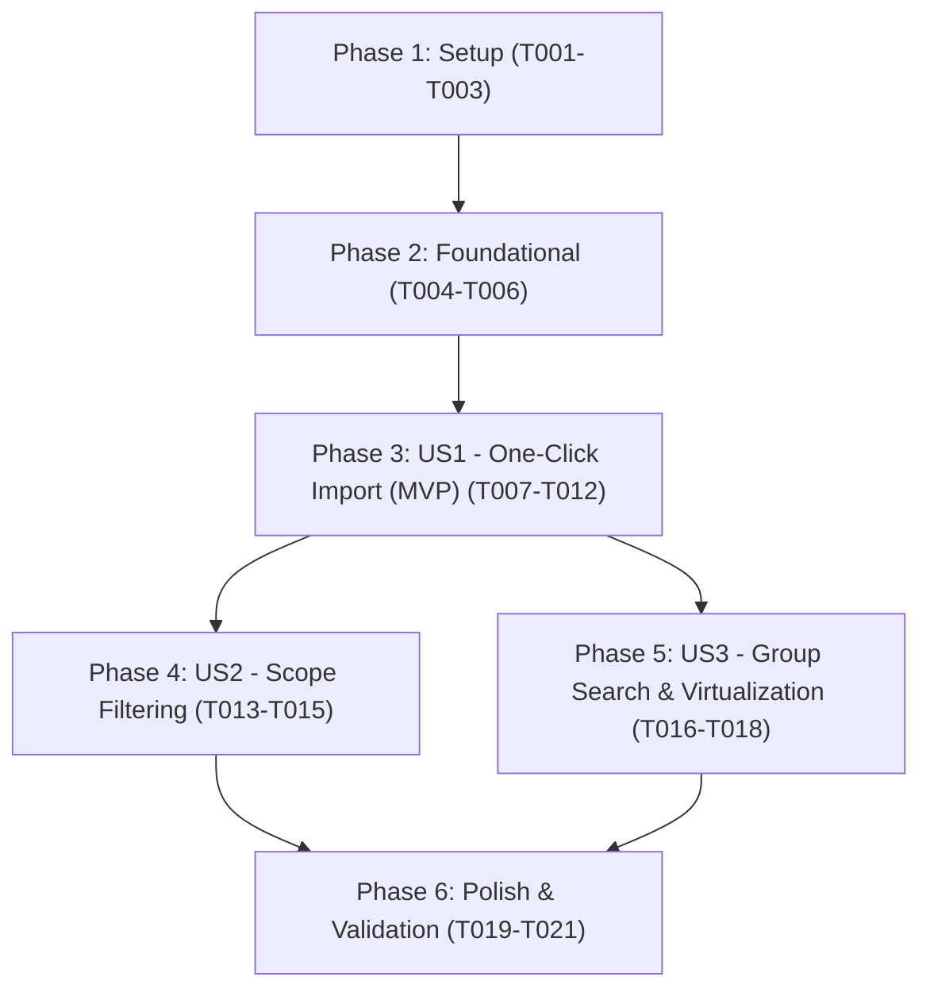

# Tasks: WhatsApp Job Link Scraper

**Feature Branch**: `001-whatsapp-link-scraper`
**Implementation Plan**: [plan.md](file:///c:/Karthikeya/Programming/Web%20development/Projects/JobShortcut/specs/001-whatsapp-link-scraper/plan.md)
**Specification**: [spec.md](file:///c:/Karthikeya/Programming/Web%20development/Projects/JobShortcut/specs/001-whatsapp-link-scraper/spec.md)

---

## Phase 1: Setup (Shared Infrastructure)

**Purpose**: Configuration, directory structure, and CLI integration for the WhatsApp scraper module.

- [X] T001 Create default WhatsApp group configurations and domain filter mappings in `backend/src/config/whatsapp-groups.ts`
- [X] T002 Add persistent browser session directory `.whatsapp_session/` to `backend/.gitignore` and repository `.gitignore`
- [X] T003 [P] Add `scrape:whatsapp` script to `backend/package.json` for CLI-based scraper execution

---

## Phase 2: Foundational (Blocking Prerequisites)

**Purpose**: Core TypeScript types, persistent Playwright session management, and SSE stream utilities required across all user stories.

**⚠️ CRITICAL**: Must be completed before implementing user stories.

- [X] T004 Define TypeScript types and interfaces (`ExtractionScope`, `WhatsAppGroupConfig`, `WhatsAppScrapeOptions`, `GroupScrapeResult`, `WhatsAppImportResult`, `WhatsAppSSEEvent`) in `backend/src/scraper/whatsapp-types.ts`
- [X] T005 Implement Playwright persistent browser context initializer and session state detector in `backend/src/scraper/whatsapp_session.ts`
- [X] T006 [P] Implement SSE event serialization and streaming helper functions in `backend/src/utils/sse-stream.ts`

**Checkpoint**: Core types and browser session foundation ready.

---

## Phase 3: User Story 1 - One-Click WhatsApp Import to Admin Scraper Box (Priority: P1) 🎯 MVP

**Goal**: An admin clicks "Import from WhatsApp" on the Admin Scraper dashboard to launch automated extraction across configured groups, handle QR login if needed, extract unread domain-matching links, and automatically populate them directly into the URL textarea ready for scraping.

**Independent Test**: Click "Import from WhatsApp" with scope "Unread" on the Admin Scraper page; verify that target domain job links from unread messages in configured groups are extracted, deduplicated, and populated into the URL textarea box with a success toast.

### Implementation for User Story 1

- [X] T007 [US1] Implement core WhatsApp link scraper engine in `backend/src/scraper/whatsapp_scraper.ts` supporting session verification, unread badge detection, conversation opening, bottom scrolling, domain link extraction, and deduplication into `string[]`
- [X] T008 [US1] Implement Express controller `backend/src/controllers/whatsapp-scraper-controller.ts` with `wrapAsync` to manage SSE stream lifecycle and trigger WhatsApp extraction
- [X] T009 [US1] Register `POST /api/scraper/whatsapp` and `GET /api/scraper/whatsapp/status` routes in `backend/src/routes/scraper-routes.ts` protected by `ensureAuthentication` middleware
- [X] T010 [P] [US1] Implement frontend SSE streaming client `startWhatsAppScraperStream` in `frontend/src/api/scraper.ts` handling `status`, `qr`, `group_progress`, `done`, and `error` events
- [X] T011 [P] [US1] Create `WhatsAppImportModal.tsx` in `frontend/src/components/WhatsAppImportModal.tsx` with scope selection, live progress logs, QR code display, and status indicators
- [X] T012 [US1] Integrate "Import from WhatsApp" button and `WhatsAppImportModal` in `frontend/src/pages/AdminScraper.tsx` with automatic population of extracted URLs into `urlInput` textarea and toast notification

**Checkpoint**: User Story 1 MVP fully functional and testable independently.

---

## Phase 4: User Story 2 - Configurable Timeframe & Scope Filtering (Today, Yesterday, Unread) (Priority: P2)

**Goal**: Allow administrators to select extraction scope (`Today`, `Yesterday`, or `Unread`) to harvest job postings across specific calendar day boundaries even after messages have been marked as read.

**Independent Test**: Select "Today" or "Yesterday" filter mode on groups with existing historical messages and verify that links are extracted accurately from messages within that designated date boundary.

### Implementation for User Story 2

- [X] T013 [US2] Implement date boundary identification and message scope extraction algorithms for `Today` and `Yesterday` in `backend/src/scraper/whatsapp_scraper.ts`
- [X] T014 [US2] Add scope selector radio/tabs (`Unread`, `Today`, `Yesterday`) with contextual explanations in `frontend/src/components/WhatsAppImportModal.tsx`
- [X] T015 [US2] Add scope parameter validation in `backend/src/middlewares/scraper-validation.ts` ensuring requested scope is one of `'unread' | 'today' | 'yesterday'`

**Checkpoint**: User Stories 1 and 2 work independently with full scope flexibility.

---

## Phase 5: User Story 3 - Resilient Group Search & Virtualization Handling (Priority: P3)

**Goal**: Ensure the scraper reliably finds configured groups located deep in chat archives using the search bar, safely validates rendered messages against virtualization limits, and isolates errors per group.

**Independent Test**: Configure a group not visible in the initial chat viewport and a group with high unread volume; verify the search bar finds and opens the group, and confirm that virtualization checks validate rendered message counts before harvesting without crashing other groups.

### Implementation for User Story 3

- [X] T016 [US3] Implement search bar lookup using `[data-testid="chat-list-search"]` and search state resetting in `backend/src/scraper/whatsapp_scraper.ts`
- [X] T017 [US3] Implement virtualization validation and safe bottom-scrolling threshold detection (`scrollTop + clientHeight >= scrollHeight - 5`) in `backend/src/scraper/whatsapp_scraper.ts` that logs warnings when rendered messages < $N$
- [X] T018 [US3] Implement per-group try/catch error isolation in `backend/src/scraper/whatsapp_scraper.ts` to log structured diagnostics and continue remaining group processing

**Checkpoint**: All user stories functional with resilient error handling.

---

## Phase 6: Polish & Cross-Cutting Concerns

**Purpose**: Final verification, CLI runner, documentation updates, and quality checks.

- [X] T019 [P] Create standalone CLI execution script `backend/src/scraper/whatsapp_cli.ts` for direct terminal execution
- [X] T020 [P] Update `PROJECTCONTEXT.md` and API documentation with the new WhatsApp scraper architecture
- [X] T021 Run complete quickstart validation per `quickstart.md` and verify zero TypeScript compiler errors across backend and frontend (`npm run build` / `npx tsc --noEmit`)

---

## Dependencies & Execution Order

### Phase Dependencies

- **Setup (Phase 1)**: No dependencies — can start immediately.
- **Foundational (Phase 2)**: Depends on Phase 1 — **BLOCKS** all user stories.
- **User Stories (Phase 3+)**: Depend on Phase 2 completion.
  - US1 (P1) is the MVP core flow.
  - US2 (P2) enhances US1 with `Today` / `Yesterday` date filtering.
  - US3 (P3) hardens US1/US2 with search bar lookup and virtualization checks.
- **Polish (Phase 6)**: Depends on completion of desired user stories.

### User Story Dependencies

### Parallel Opportunities

- **Phase 1**: `T002` and `T003` can execute in parallel after `T001`.
- **Phase 2**: `T006` can execute in parallel with `T004`/`T005`.
- **Phase 3 (US1)**: `T010` (frontend API client) and `T011` (modal component) can be developed in parallel while `T007`/`T008` (backend engine) are built.
- **Phase 6**: `T019` and `T020` can run in parallel before final build verification `T021`.

---

## Implementation Strategy

### MVP First (User Story 1 Only)
1. Complete **Phase 1: Setup** (T001-T003)
2. Complete **Phase 2: Foundational** (T004-T006)
3. Complete **Phase 3: User Story 1** (T007-T012)
4. **Validate MVP**: Test the "Import from WhatsApp" button on AdminScraper page end-to-end.

### Incremental Delivery
1. Deliver US1 (MVP unread link extraction + 1-click import into textarea).
2. Deliver US2 (Today/Yesterday scope filtering).
3. Deliver US3 (Search bar lookup + virtualization safeguards).
4. Run validation & Polish.
